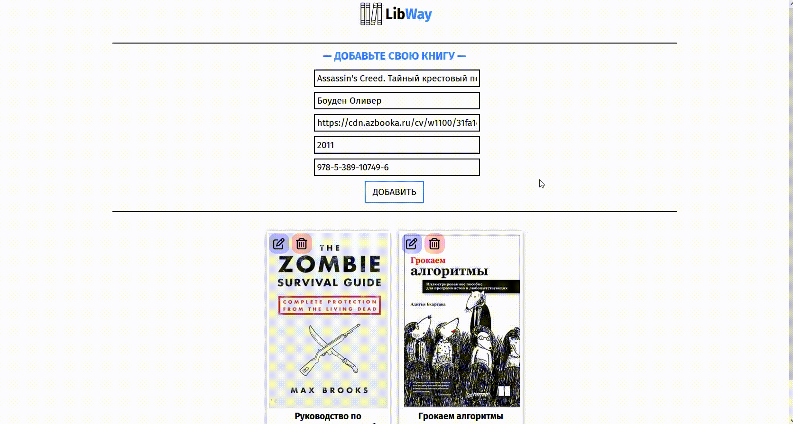
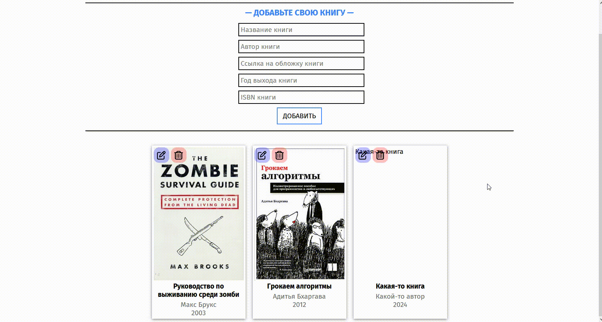
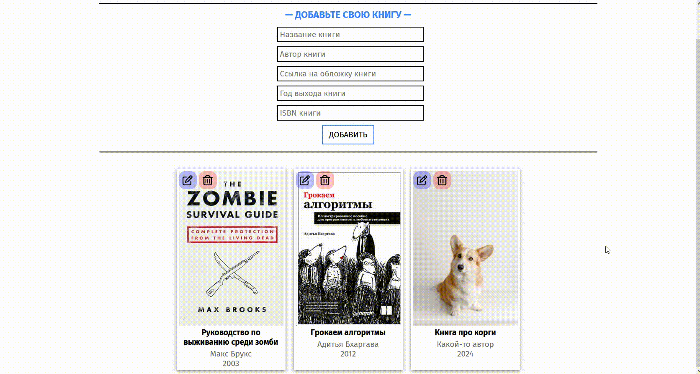

# Объектно-ориентированное программирование, ЛР 5
Подключить к проекту ЛР 4 базу данных MySQL, вместо JSON файла использовать БД. Должны быть реализованы все четыре элемента CRUD (create-read-update-delete).

## Примеры работы программы
### Добавление книг
 

### Изменение книг
 

### Удаление книг
 
